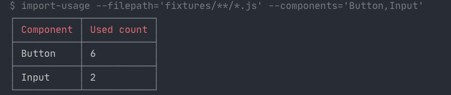

### What it is

It is a cli tool to figure out the usage of any specific `import` in your source files

- Supports [glob](https://www.npmjs.com/package/glob) patterns for searching in files.
- Supports scoping the import search. See `--scope` argument
- Supports ignoring directories while searching
- Supports 3 output report formats - `table(default), csv, json`

### Installing

```shell
yarn add import-usage
```
or

```shell
npm install import-usage
```

### How to use

```shell
import-usage -h

Options:
  --filepath      File or directory path or glob pattern     [string] [required]
  --components    Comma separated component names            [string] [required]
  --ignore        Directories to ignore i.e node_modules
                                        [string] [default: "**/node_modules/**"]
  --reportformat  stdout format of data
                   [string] [choices: "table", "csv", "json"] [default: "table"]
  --scope         If defined, components only from this package will be searched
                                                                        [string]
```

### Using in package.json

```shell
yarn add import-usage
```
or

```shell
npm install import-usage
```

In your `package.json`

```json
{ 
  "scripts" : {
    "show-component-usage" : "import-usage --filepath='src/**/*.js' --components='Button,Input' --ignore='**/node_modules/**' --reportformat='csv' --scope='@scoped-package/ui'
  }
}
```

### From CLI

```shell
yarn global add import-usage
```
or
```shell
npm -g install import-usage
```
then from terminal

```shell
import-usage --filepath='src/**/*.js' --components='Button,Input' --ignore='**/node_modules/**' --reportformat='csv' --scope='@scoped-package/ui'
```

### Output


